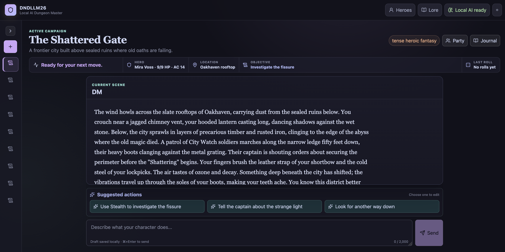

# DNDLLM26

A local AI Dungeon Master for solo D&D-style adventures. It runs on your computer, streams scenes from Ollama, owns the dice and combat rules, and remembers your campaigns between sessions.



## What you can do

- Build reusable heroes across six classes and four ancestries
- Play solo or bring along DM-controlled companions
- Explore persistent stories with quests, NPCs, world facts, rests, and progression
- Fight turn-based battles with initiative, lanes, HP, conditions, class actions, and death saves
- Add local PDF lore for the DM to reference
- Pick separate Ollama models for narration, rules, and lore search
- Stop, restart, and safely retry interrupted actions without duplicating turns or dice rolls

Everything stays local: **React + FastAPI + SQLite + Ollama + LanceDB**. There are no accounts, cloud services, or extra queue/database servers.

## You will need

- Python 3.11–3.14
- [uv](https://docs.astral.sh/uv/)
- [Bun](https://bun.sh/)
- [Ollama](https://ollama.com/) running locally

The default models are small enough to get started easily:

```bash
ollama pull llama3.2:3b
ollama pull llama3.2:1b
ollama pull nomic-embed-text
```

You can swap these for compatible installed models later from the Settings cog.

## Start playing

From the project folder:

```bash
bun run dev
```

The launcher installs the locked Python and frontend dependencies, starts both local services, waits until they are ready, and opens the app at [http://127.0.0.1:5173](http://127.0.0.1:5173).

That is all you need for the normal setup. If you want to change ports, model defaults, storage paths, or PDF limits, copy `.env.example` to `.env` first and edit it:

```bash
cp .env.example .env
```

On Windows PowerShell, use `Copy-Item .env.example .env`.

## Handy commands

```bash
bun run dev             # Run the development app
bun run start           # Build and run a production preview
bun run build           # Type-check and build the frontend
bun run check           # Run every backend/frontend check
bun run test:backend    # Backend tests only
bun run test:frontend   # Frontend tests only
```

The local API docs are available at [http://127.0.0.1:8765/api/docs](http://127.0.0.1:8765/api/docs) while the app is running.

## Your data

Campaigns and generated runtime files live under `data/`:

```text
data/
├── dndllm26.db
├── uploads/
└── lancedb/
```

This folder and `.env` are ignored by version control. Back up `data/` if you want to keep your adventures when moving to another computer.

The app only binds to loopback addresses and has no remote login system. Do not expose its ports through a public tunnel, reverse proxy, router port-forward, or public container binding.

Existing databases must match the current schema. An incompatible database is left untouched so you can archive it yourself before starting fresh. To inspect the current database:

```bash
uv run dndllm26-integrity
```

## Lore PDFs

Upload PDFs from the Lore panel. They are stored locally, split into searchable passages, and indexed with the selected embedding model. Scanned image-only PDFs need OCR first.

If lore stays queued, check that Ollama is running and that the configured embedding model is installed. Restarting the app safely resumes queued or interrupted indexing work.

## Quick troubleshooting

**The runtime says Ollama is unavailable**  
Start Ollama, run `ollama list`, and make sure the selected models are installed. You can refresh the runtime status from the app.

**A configured model is missing**  
Pull it with `ollama pull <model>` or choose another compatible installed model in Settings.

**The database schema is incompatible**  
The app will not overwrite it. Move the old `data/dndllm26.db` somewhere safe, then restart to create a fresh database.

**A PDF has no searchable text**  
It is probably a scan. Run OCR on the file before uploading it.

## Licence

See [LICENSE](LICENSE) for the project licence and usage terms.
